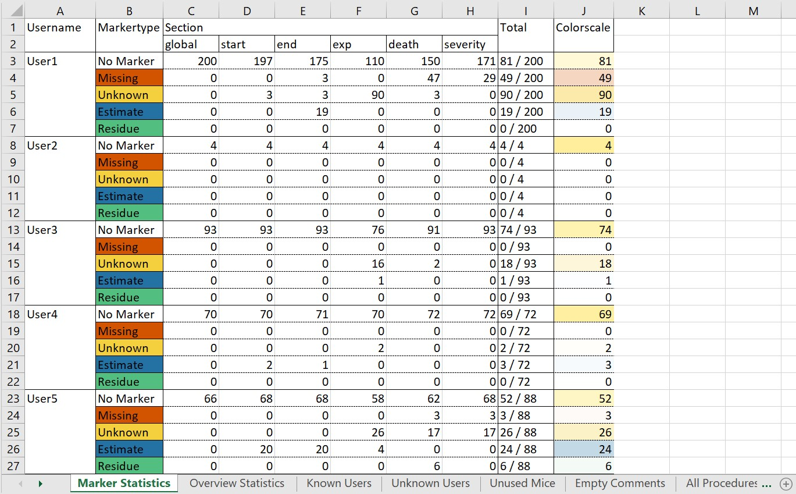
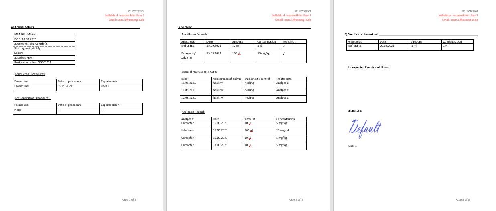
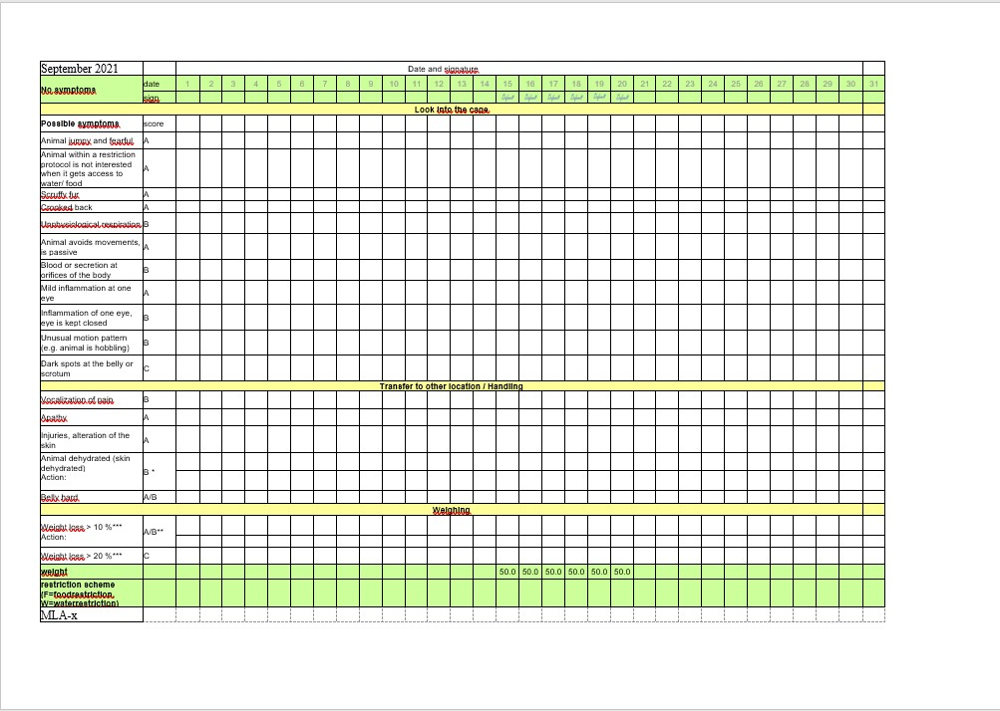
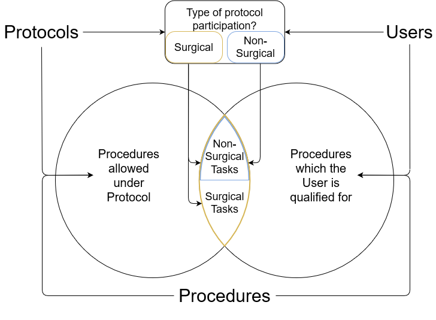
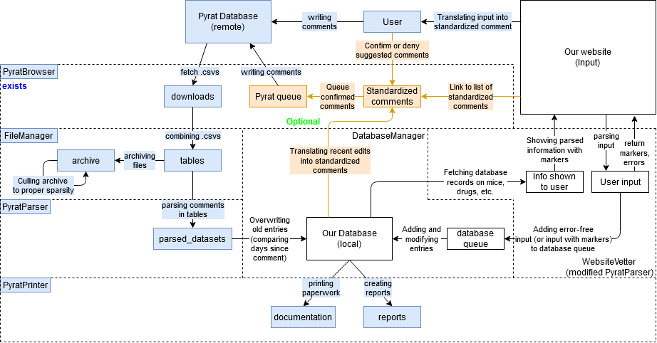

# Automatic Documentation Processor


During my work as a researcher at the Charité I was often faced with the recurring task of documenting animals, as is required by german law. Every researcher has to document any procedures and drugs, as well as the daily weight and health status of every animal. To streamline this process I decided to write this processor.
It uses an already existing system (PyRAT), which is used to organize orders and transports of animals. My colleagues already used a pseudo-json comment to collect informations on the mice in this system, and I extended and standardized this comment to work with the processor.

A comment could look like this:
```
user: User1; surgeon: User1; exp: G001/21; procedure: procedure1 (15/09/21);
medication: Ketamine/Xylazine 100μl (15/09/21), Carprofen 10μl (15/09/21 - 17/09/21), Isoflurane 10ml (20/09/21); 
start: 15/09/21; start_weight: 50g; severity: middle; end: 20/09/21; death: painfree sacrifice;
```

This information, together with the already existing information in the order system, would suffice to create the documentation for procedures and drug used, and could prefill some of the information in the daily checkup sheets.
Once the processor had parsed a set of these entries, it also produced a compact report on any missing entries or entries that appeared to be out-of-order.



With the help of the report any user could check if their records appeared to be correct and complete. Once this was ensured they could create the full documentation from the dataset with the click of a single button.




With this processor I was able to greatly reduce the time spent on writing the legally required documentation for the entire lab, and we are currently in the process of developing a server-based extension of the processor, to store the weights and statuses of every mouse centrally.
This approach would also allow us to ensure that every entry in the database matches the permissions and qualifications of the respective lab members.



Below you can see a diagram of the planned elements (white), the elements which already exist (blue), and optional elements of this solution (orange).


