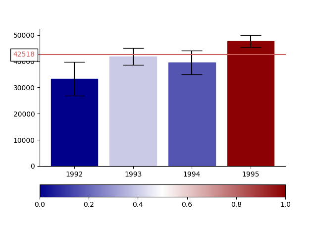
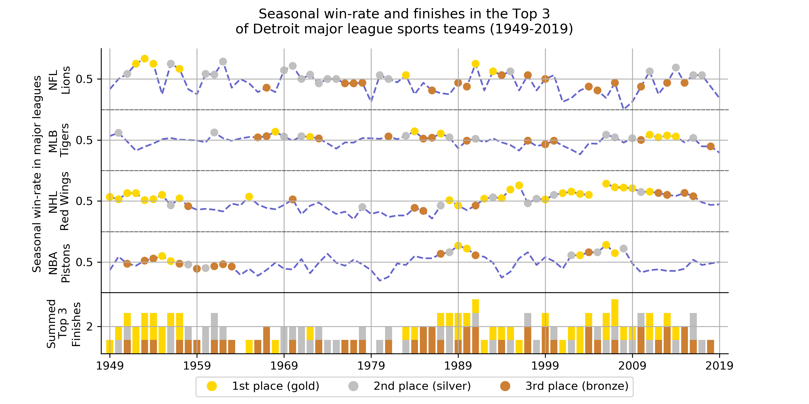

# Coursera: Applied Data Science in Python

To deepen my knowledge in the proper visualization and analysis of data I worked to attain a specialization in Coursera for Applied Data Science in Python. Part of this specialization were courses in text mining, machine learning and social network analysis. Especially in the module on text mining I could apply my prior experience with the development of the initial prototype of the [Automatic Documentation Processor](https://github.com/Marti-Ritter/Portfolio/tree/main/Automatic%20Documentation%20Processor%20(Python)).

