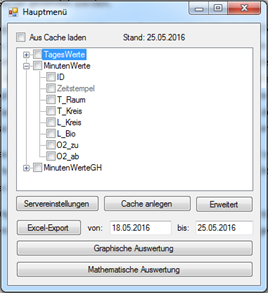
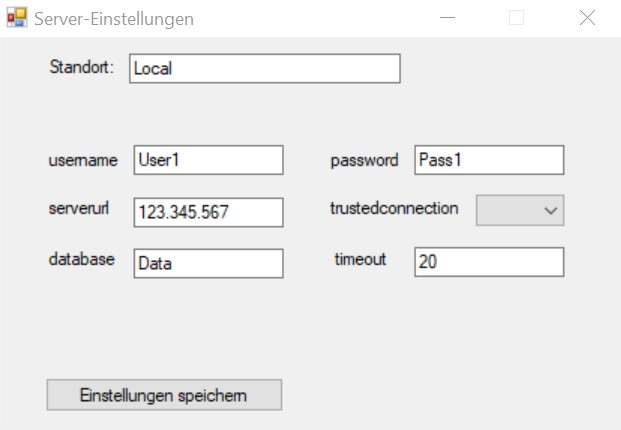
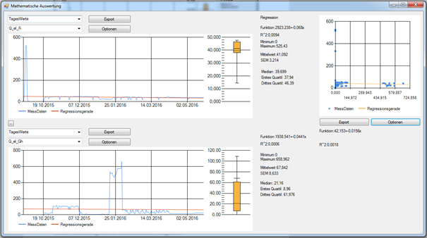

# Exploring Aquaponics Data

During the last semester of my bachelor's I decided to write my Bachelor's thesis at the Leibniz Institute of Freshwater Ecology and Inland Fisheries (IGB for short). They worked on a novel project to combine the breeding of fish and the growing of tomatoes in a nearly closed loop. The potential to reduce the ecological impact of food production and the complex systems needed to optimize the production cycle fascinated me. Since there were no prior integrated ways to visualize the diverse dataset collected in the project, I was tasked with developing a software solution to accomplish this task.

In this project I had to handle the connection to potentially multiple remote server, with non-uniform database structures, and unclear table contents. Since most of the local systems ran with Windows I decided to write the program in C#. By allowing the user direct access to labels, scales, and layouts the software was adapted to work with nearly all databse structures found in the research project, and allowed the creation of publishable figures.

More details, and the user guide, can be found in my Bachelor's thesis.
