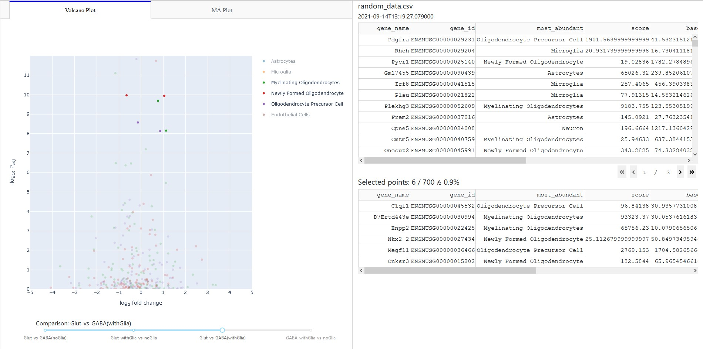

# Exploring Changes in Gene Expression

During a collaboration with a colleague on a cell culture project he asked me whether I could write a dashboard that would allow him and other members of his group to explore the results coming from the RNA-sequencing work in their project. There were multiple plots they were interested in and they also wanted to be able to compare multiple conditions and data points with each other. I used Plotly Dash for this task and wrote the above dashboard, which I deployed to heroku (a free platform).

I also preprocessed the data with the help of DeSEQ2 (in R) and wrote a number of plots in R.

The shuffled, randomized data can be found in random_data.csv and can be used to test the dashboard by dropping it into the box shown on the start screen at https://paul-data.herokuapp.com/.
