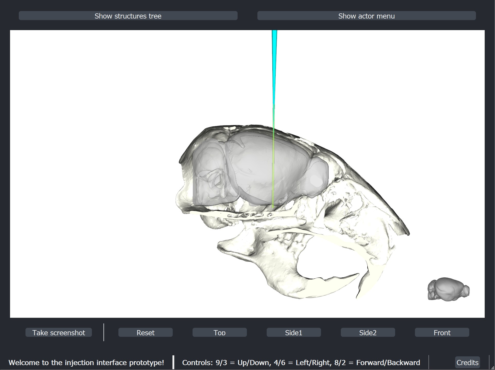

# Injection Interface

During my time in neuroscience I spent a lot of hours with my colleagues in surgeries. One of the procedures we performed was the stereotaxic injection. In this procedure a small drop of a viral vector is injected with high accuracy in a specific brain region. To guarantee that the surgery is a success, one needs to ensure that the mouse as well as the injector are both properly mounted and aligned. Usually people in our lab used a copy of the Allen Brain Atlas (https://portal.brain-map.org/) for mice to determine the coordinates of the injection before the procedure and then headed towards the surgery room.
Due to this separation of target definition and procedure it can easily happen that one misaimes the injection or is not completely aware of any brain regions which lie above the injection site and could potentially be affected by backflow of the viral vector.
To solve this problem I modded the (now archived) GUI implemented by the creators of Brainrender (https://github.com/brainglobe/bg-brainrender-gui). I liked the seamless integration of a variety of brain atlases and the option to add specific connectivity maps or pipettes to the atlas.

Modifying the previous interface required a deeper understanding of the different layers of the graphics toolkit, as well as the different modules built on top of it, and allowed me to explore a new way to visualize complex situations and data.
