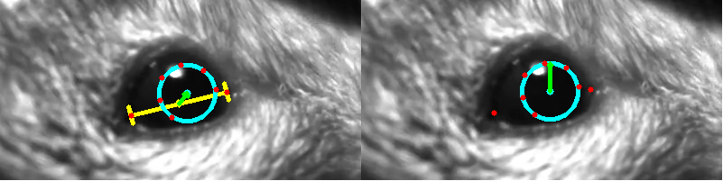

# Threat Perception Analysis

This repo contains some of the code I used to analyse the output of the novel threat perception setup. Most of the data was acquired by two cameras aimed at the body and face of the mice. This video data was then analyzed with the help of DeepLabCut (www.mousemotorlab.org/deeplabcut), and the resulting labeled body traces were then cleaned and processed with Pandas in Python. An example of the labels used in this project can be seen above.

In a few side projects I also used DeepLabCut to analyze the behavior of freely moving mice in a variety of paradigms. An example frame from one of the experiments can be seen below.

