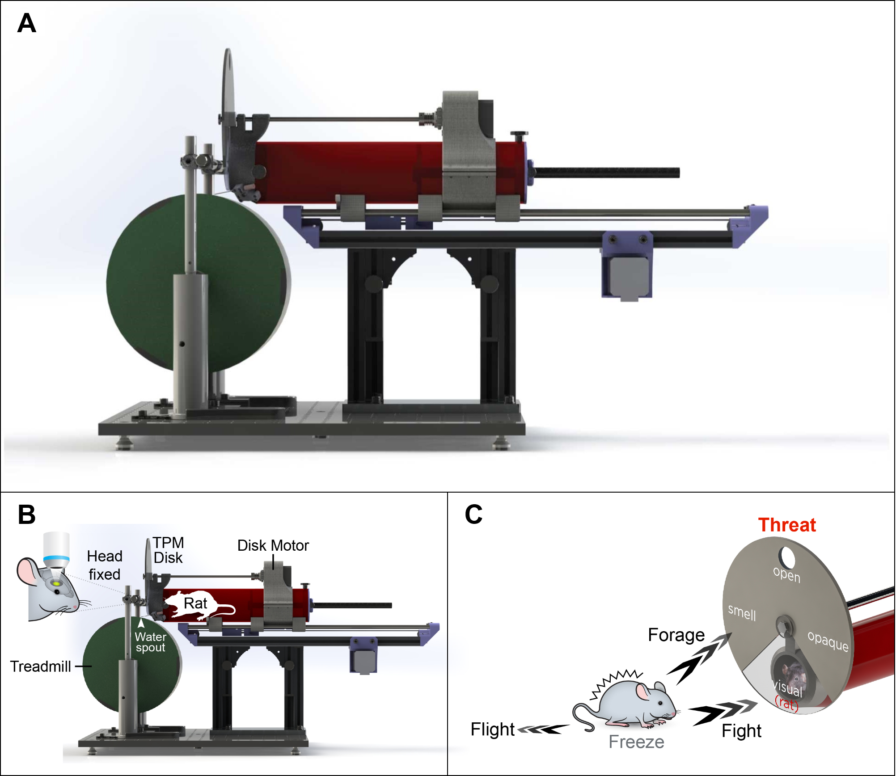
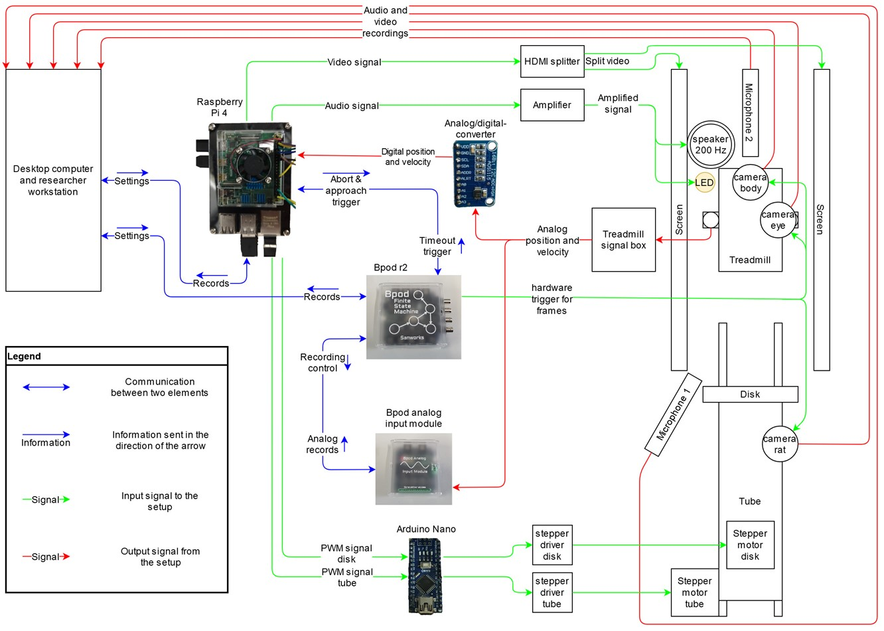

# Threat Perception Setup

This repository contains the code and documentation for a research project investigating innate threat perception.
The development and engineering of this novel setup were part of my Master's thesis and involved the use of both Matlab and Python. To accurately record and react to the movement of a headfixed mouse on a treadmill, the setup had to be designed to distribute the many different tasks, such as recording, actuating, displaying, and timing, onto multiple components. These components included a Raspberry Pi, an Arduino (which was programmed by a colleague of mine), a PC workstation, and a Bpod finite state machine (developed by Sanworks LLC). The communication between these elements had to be synchronized and reliable and had to also work across many successive trials with multiple outcome conditions.
The details of the development and implementation of this setup can be found in my Master's thesis.

